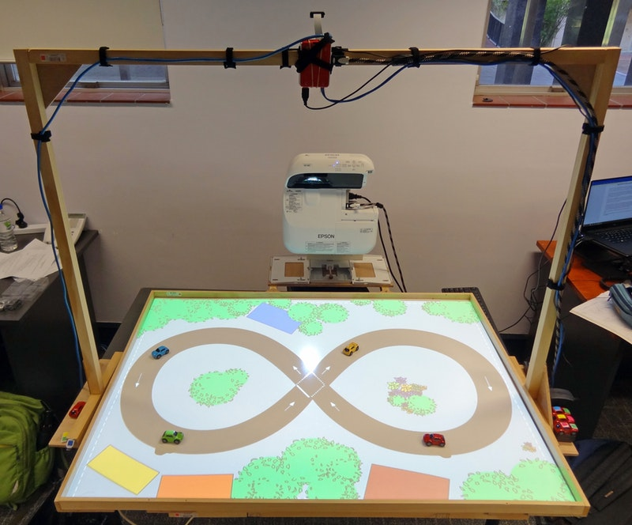

# Autonomous Vehicle Testbed

This repository contains code accompanying the paper [A Low-Cost Hardware-in-the-Loop Agent-Based Simulation Testbed for Autonomous Vehicles, AIM 2018](https://doi.org/10.1109/AIM.2018.8452376).

## Videos
  * [Pitch for the WAITTA INCITE Awards 2018](https://www.youtube.com/watch?v=ow3AwdkZjmE)
  * [Demonstration](https://www.youtube.com/watch?v=ZffbxWcBJSA)
  * [Demonstration (Extended)](https://www.youtube.com/watch?v=K4qyH0TRK90)
