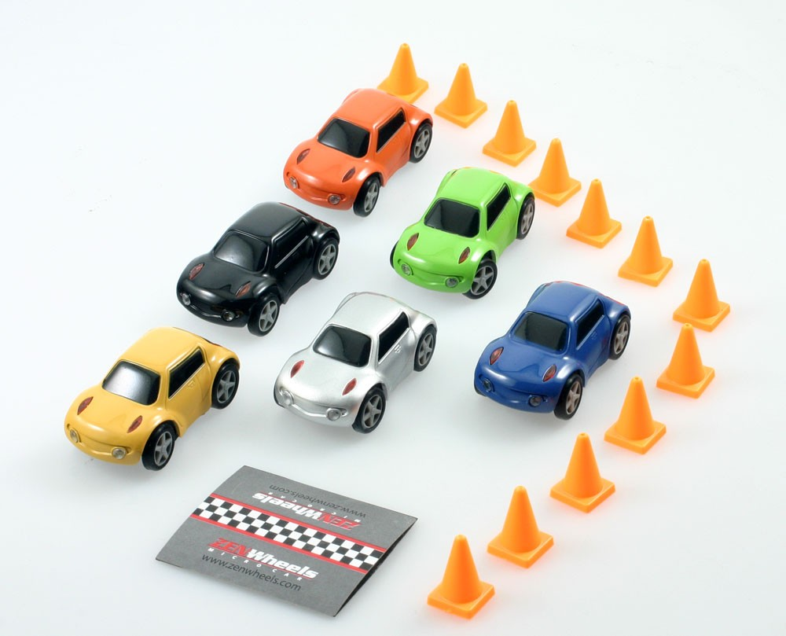
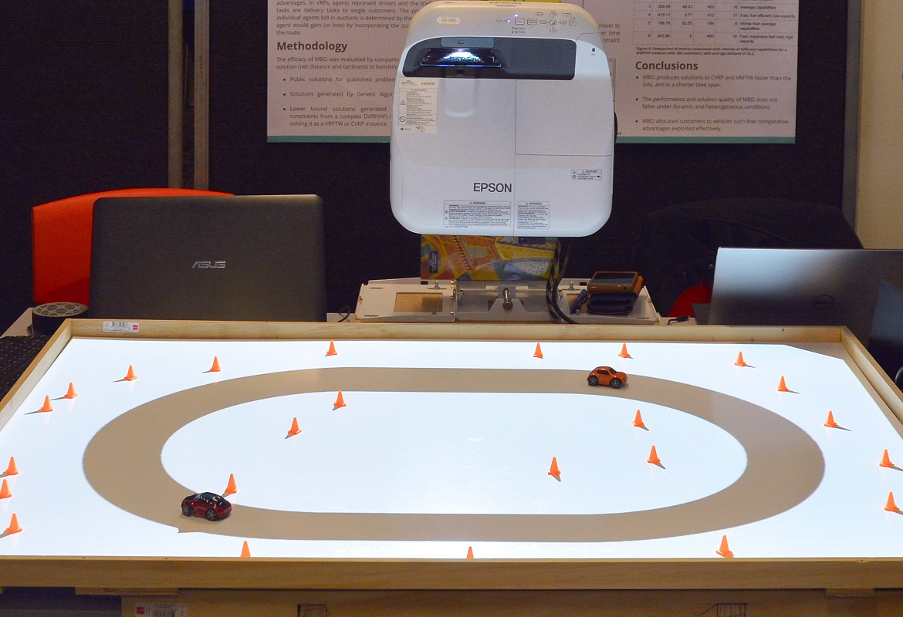
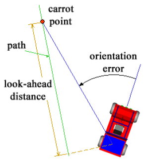
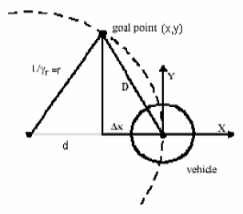
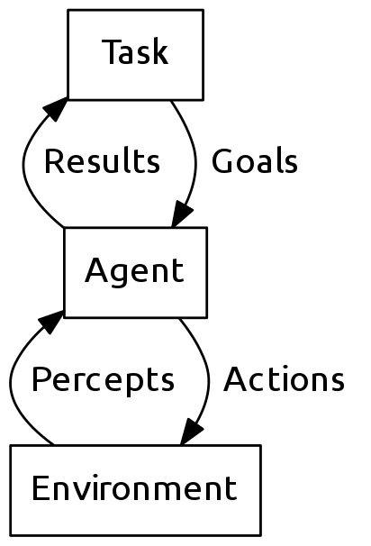
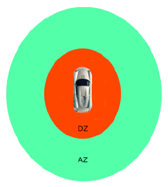

# Overview of the system

## Background

- The development of autonomous vehicles systems is on the rise
- Testing on full scale vehicles under a wide range of conditions can be expensive and time consuming
- Implementing a low cost miniature car testbed that accurately simulates real life traffic would aid researchers in being able to validate their algorithms beforehand

## System design

### Hardware used

- Bluetooth-controlled ZenWheels microcars
- Raspberry Pi 3 microcomputer
- Table mounted projector
- Pixy machine vision camera

### Functional requirements

- Steer multiple vehicles using an overhead vision system
- Use image processing methods to determine the position and orientation of the vehicles in real-time
- Perform path tracking to determine how the speed and steering angle of the vehicles should be set at each time interval to follow the road and avoid collisions

## System architecture

\centerline{\includegraphics{architecture.png}}

## Design goals

- Use easy to assemble materials for portability
- Support dynamic track environments
- Handle up to 8 cars simultaneously
- Be able to correct deviations caused by systematic errors
- Be able to avoid obstacles introduced into the environment

## ZenWheels micro cars

[columns]

[column=.6]

- $49.99 USD each
- Proportional steering and throttle control
- Comes in a range of colours
- 1:87 scale
- Runs for ~20 minutes on full charge

[column=.4]

\ 

[/columns]

# Interfacing with ZenWheels micro cars

## Debugging ZenWheels Android application

\centerline{\includegraphics{android-studio.png}}

## Packet sniffing with Wireshark

\centerline{\includegraphics{wireshark.png}}

## Protocol

- Two byte messages consisting of a channel to read/write to and a value
- Values are 7-bit signed ($-64 \leq x \leq 63$)
- Maximum packet size is 128 bytes

[columns]

[column=.5]

Can control:

- Steering angle
- Throttle
- Front and rear signals
- Headlights
- Underside lights
- Horn

[column=.5]

Can check:

- Hall effect sensor (for detecting the magnetic finish line strip)
- Battery voltage
- Shutdown reason (timeout reached, low battery, etc.)

[/columns]

# Handling Bluetooth communications in Python

## Why Python?

- Comes preinstalled with Raspbian
- Has cross-platform Bluetooth support via PyBluez
- API is easy to use compared with writing low-level C code
- Built-in support for concurrent data structures

## Using Bluetooth sockets

```python
# Opening a connection
socket = BluetoothSocket(RFCOMM)
socket.connect(('00:06:66:61:AC:9E', 1))

# Sending data
socket.send(bytes([0x82, 0x10]))  # Set throttle to +16
socket.send(bytes([0x82, 0x70]))  # Set throttle to -16

# Receiving data
data = socket.recv(1024)
for msg in chunks(data, 2):
  if msg[0] == 0xc0:              # Battery voltage
    print('{0:.1f} V'.format(msg[1] / 10.0))
```

## Concurrency issues

- Need to handle multiple connections at the same time
- Need to reestablish connections if they drop out
- How can we handle this?

. . .

- Solution: Have three threads – one for establishing connections, one for receiving data and one for sending data
- Use select() to determine which sockets have data available and implement message queues

## Using message queues
```python
try:
  can_read, can_write, _ = select([socket], [socket], [])
  if socket in can_read:
    data = socket.recv(1024)
  if socket in can_write:
    try:
      msg = out_queue.get_nowait()
    except queue.Empty:
      pass
    else:
      socket.send(msg)
except BluetoothError:
  socket.close()
```

## Asynchronous I/O

- Using non-blocking sockets, connections can be established in parallel reducing the startup overhead of the controller

```python
socket.settimeout(0)
```

- One disadvantage of this method is that the OS will wait longer on a connection before giving up and retrying

## Integration with other system components

- The OpenCV detection system is able to match cars to their MAC addresses
- The MAC address, position, velocity and orientation of the cars are encoded in JSON and then sent to the agent controller over a TCP socket
- The agent controller decides upon actions and passes them onto the Bluetooth system's message queue to be sent

## Performance

[columns]

[column=.5]

- Reasonably stable with two cars of different colours
- Can steer around in a loop defined by a sequence of fixed waypoints
- Bluetooth messaging is slower than the time for the vision system to process an image but does not hinder performance significantly
- Progress is being made towards getting a figure of eight working

[column=.5]

\ 

[/columns]

# Implementing path tracking and agent-based algorithms

## "Follow the carrot"

[columns]

[column=.6]

1. Obtain a goal point
2. Aim the vehicle towards that point
\newline
- Although easy to understand and implement this has some major disadvantages
    - Vehicle will have a tendency to naturally cut corners and could oscillate about the path

[column=.4]

\ 

[/columns]

## Pure pursuit

[columns]

[column=.7]

- Currently being implemented
- Calculates the curvature that will take the vehicle from its current position to a goal position
- Goal point is determined in the same manner as for the follow-the-carrot algorithm
- A circle is then defined in such a way that it passes through both the goal point and the current vehicle position
- Finally, a control algorithm chooses a steering angle in relation to this circle

[column=.3]

\ 

[/columns]

## Pure pursuit

[columns]

[column=.7]

1. Obtain current position of the vehicle
2. Find the goal point:
    a. Calculate the point on the path closest to the vehicle $(x_c, y_c)$
    b. Compute a certain look-ahead distance $D$
    c. Obtain goal point by moving distance $D$ up the path from point $(x_c, y_c)$
3. Transform goal point to vehicle coordinates
4. Compute desired curvature of the vehicle $\gamma = 2 \Delta x/D^2$
5. Move vehicle towards goal point with the desired curvature
6. Obtain new position and go to step 2

[column=.3]

\ 

[/columns]

## Agent architecture

[columns]

[column=.7]

- Infer high level actions from goals, e.g.
    - Drive to a point
    - Curve to a point
    - Circle a roundabout
    - Turn left/right
    - Go straight
    - Wait
    - Park
- Take corrective actions based on percepts (position, orientation and velocity)

[column=.3]

\ 

[/columns]

## Collision avoidance

[columns]

[column=.8]

- Not yet implemented
- An algorithm proposed by Ek et al. (2015) involves driving around the obstacle and trying to overtake it. They use two zones termed the "activation zone" and the "dead zone".
- When a vehicle reaches the activation zone of an object or another vehicle they temporarily modify the track layout by placing new points parallel to the track at the point of the obstacle just outside of the dead zone, resulting in a trajectory that avoids the collision.

[column=.2]

\ 

[/columns]

# Simulation uses of the testbed

## Human vs. autonomous drivers

- The agent controller has abstract classes allowing for different driver implementations
- Human drivers will have filtered info available for use, e.g. limited field of view
- Acceleration and response times can also be varied
- Gipps' following model can be used for simulating platooning

## Other possible simulations

- Scheduling optimisation
- Virtual traffic light protocol
- Demonstrating Braess' paradox

## Potential improvements

- Merging the vision system and agent controller into a single application
- Rewriting the agent controller in C with libbluetooth and pthreads to optimise performance
- Studying the PID controller implementation of the car firmware to obtain a more accurate model of the car's dynamics

## Acknowledgements

- Suter, J 2016, \textit{Miniature Vehicle Testbed for Intelligent Transportation Systems}, honours thesis, Ohio State University.
- Lundgren, M 2003, \textit{Path Tracking and Obstacle Avoidance for a Miniature Robot}, masters thesis, Intelligent Off-Road Vehicles, Umeå University.
- Ek, J, Gunnarsson, J, Hellaeus, V, Insgård, V, Kuosku, M & Norrblom, W 2015, \textit{Advanced vehicle control systems: A multi-vehicle experimental platform for automotive algorithms}, honours thesis, Chalmers University of Technology.

---

\centerline{\Large{Questions?}}
